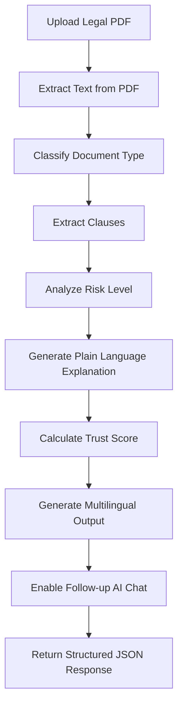
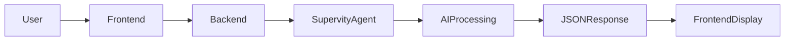

# ⚖️ LegalEase AI

### Understand Any Legal Document in 10 Seconds

🚀 **AI-Powered Legal Document Simplifier built using Supervity Agents**

LegalEase AI helps everyday people understand complex legal documents like rental agreements, job offers, and loan contracts using an intelligent AI agent workflow.

---

# 🌟 Overview

Legal documents are often long, complex, and difficult to understand. Many people sign agreements without knowing the risks hidden inside.

**LegalEase AI solves this problem** by allowing users to upload any legal document and instantly receive:

✅ Plain-language summaries
✅ Risk detection per clause
✅ Trust Score (0–100)
✅ Clause-by-clause explanations
✅ Multilingual output
✅ Follow-up AI conversation

This system is built using **Supervity AI Agents** and a **full-stack web application**.

---

# 🎯 Problem Statement

**Domain:** LegalTech
**Code:** #08
**Problem:**
Common people do not understand legal documents like rental agreements or employment contracts and often sign without knowing the risks.

**Solution:**
Build a tool where users upload any legal document and get a plain-language summary of important points and risky clauses.

---

# 🧠 Agent Workflow — How the AI Works

Our LegalEase AI agent runs through a structured multi-stage workflow.



---

# 🔍 Step-by-Step Agent Execution

## Step 1 — Extract Text from PDF

📄 The agent reads the uploaded legal document.

It extracts:

* Full text
* Structure
* Clause boundaries

Output:

```json
{
  "raw_text": "Full legal text..."
}
```

---

## Step 2 — Classify Document Type

The AI automatically detects:

* Rental Agreement
* Job Offer
* Loan Agreement
* NDA
* Vendor Contract

Output:

```json
{
  "document_type": "Rental Agreement",
  "confidence": 0.94
}
```

---

## Step 3 — Extract Clauses

The document is split into structured clauses.

Each clause contains:

* Clause Number
* Title
* Full Text

Output:

```json
{
  "clauses": [
    {
      "clause_number": 1,
      "title": "Eviction Notice",
      "text": "The landlord reserves the right..."
    }
  ]
}
```

---

## Step 4 — Risk Analysis Engine

Each clause is evaluated for potential risks.

Risk Levels:

🔴 **RISKY**
🟡 **CAUTION**
🟢 **SAFE**

The AI detects:

* Unfair conditions
* Missing protections
* Legal red flags

---

## Step 5 — Plain Language Generator

Each clause is rewritten into simple English.

Example:

Original:

> The landlord reserves the right to terminate tenancy without prior notice.

Simplified:

> Your landlord can remove you without warning.

---

## Step 6 — Trust Score Calculation

A global Trust Score is calculated.

Score Range:

| Score  | Status      |
| ------ | ----------- |
| 0–40   | 🔴 Risky    |
| 41–65  | 🟡 Moderate |
| 66–100 | 🟢 Safe     |

---

## Step 7 — Multilingual Output

Users can choose:

🌐 English
🌐 Hindi
🌐 Telugu

The AI automatically translates the results.

---

## Step 8 — Conversational Follow-Up

Users can ask:

* "Explain clause 5"
* "What is the biggest risk?"
* "Is this safe to sign?"

The agent responds with contextual answers.

---

# 🧩 System Architecture



---

# 🖥️ Tech Stack

## Frontend

* React (Vite)
* Tailwind CSS
* Framer Motion
* React Dropzone
* Lucide Icons

---

## Backend

* FastAPI
* httpx
* Python Multipart
* Streaming API Handling

---

## AI Agent

* Supervity.ai
* Multi-node workflow
* LLM-powered analysis

---

# 🎨 Key Features

## 🧾 Smart Document Understanding

Upload any legal PDF and receive instant insights.

---

## 🎯 Trust Score Meter

Visual circular gauge displaying document safety.

---

## 🔥 Risk Heatmap

Color-coded clause risk levels:

🔴 Risky
🟡 Caution
🟢 Safe

---

## 📚 Clause-by-Clause Breakdown

Each clause includes:

* Title
* Plain explanation
* Risk reason

---

## 💬 AI Chat Assistant

Ask follow-up questions about any clause.

---

## 🌐 Multilingual Support

Supports:

* English
* Hindi
* Telugu

---

## 🔊 Voice Readout

Listen to the summary using speech output.

---

## 📱 WhatsApp Share

Share summary instantly.

---

# 📁 Project Structure

```
legal-ease/

backend/
│
├── main.py
├── requirements.txt
└── .env

frontend/
│
├── src/
│   ├── components/
│   │   ├── UploadPage.jsx
│   │   ├── ResultsPage.jsx
│   │   ├── TrustScoreMeter.jsx
│   │   ├── ClauseCard.jsx
│   │   ├── ChatPanel.jsx
│   │   └── ActionBar.jsx
│   │
│   ├── App.jsx
│   └── index.css
│
├── package.json
└── vite.config.js
```

---

# ⚙️ How to Run Locally

## Backend

```bash
cd backend

pip install -r requirements.txt

uvicorn main:app --reload
```

Backend runs at:

```
http://localhost:8000
```

---

## Frontend

```bash
cd frontend

npm install

npm run dev
```

Frontend runs at:

```
http://localhost:5173
```

---

# 🔗 API Endpoints

## Analyze Document

```
POST /api/analyze
```

Uploads PDF and returns analysis.

---

## Follow-up Chat

```
POST /api/followup
```

Ask questions about the document.

---

## Health Check

```
GET /api/health
```

Returns server status.

---

# 📊 Sample Output JSON

```json
{
  "status": "success",
  "document_type": "Rental Agreement",
  "trust_score": 58,
  "trust_label": "MODERATE",
  "total_clauses": 12,
  "risk_summary": {
    "risky": 3,
    "caution": 4,
    "safe": 5
  }
}
```

---

# 🌍 Real-World Use Cases

🏠 Tenant reviewing rental agreement
🎓 Fresher reviewing job offer
🏪 Small business reviewing vendor contract
🏦 Person reviewing loan agreement

LegalEase AI protects users from hidden risks.

---

# 🚀 Why This Project Stands Out

✔ Full End-to-End AI Agent
✔ Real-world legal assistance
✔ Multilingual support
✔ Modern animated UI
✔ Scalable architecture
✔ Production-ready system

This is **not a chatbot** — it is a **legal intelligence platform**.

---

# 🧪 Future Enhancements

* OCR for scanned documents
* Legal compliance validation
* Digital signature integration
* Risk negotiation suggestions
* Mobile application version

---

# 👨‍💻 Built For

🏆 **CodeQuest AI — Final Round Hackathon**

---

# ❤️ Built With Passion

Created using:

* Supervity AI Agents
* FastAPI Backend
* React Frontend
* Tailwind UI

Empowering people to understand legal documents before signing them.

---

# ⭐ If You Like This Project

Give it a ⭐ on GitHub!
