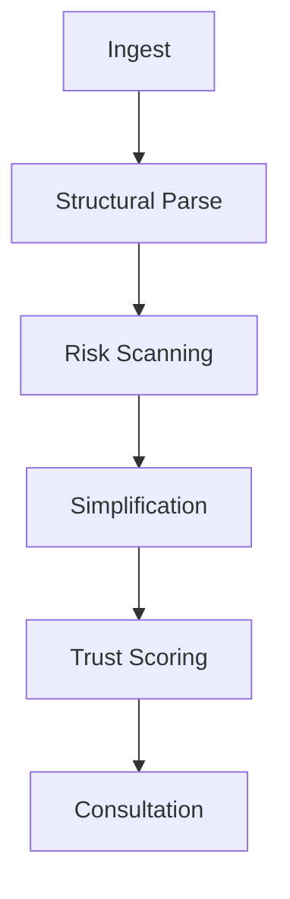

<div align="center">
  **Legal document clarity in < 10 seconds. Powered by Supervity AI Agents.**
</div>

---

## 🌟 The Vision

Legal documents are intentionally complex, often hiding risks in dense legalese. **LegalEase AI** is a production-grade intelligence platform that empowers everyday people to audit contracts, job offers, and rental agreements before signing them.

> [!TIP]
> This isn't just a chatbot—it's a multi-staged AI Agentic Workflow that dissects legal text with structural precision.

---

## 🧠 The Agentic Workflow

Our AI Agent doesn't just read; it processes. Following a structured multi-node execution path:

<div align="center">



</div>

### 1️⃣ Ingest
Securely parses uploaded PDF documents into an isolated cloud vault for analysis.

### 2️⃣ Structural Parse
The AI Agent detects document hierarchy: clauses, headers, parties, and effective dates.

### 3️⃣ Risk Scanning
The core auditor logic identifies 50+ common legal red flags and "unfair" conditions.

### 4️⃣ Simplification
High-density legalese is translated into "human-readable" plain language for total clarity.

### 5️⃣ Trust Scoring
A global safety metric (0-100) is calculated based on risk density and document transparency.

### 6️⃣ Consultation
Active follow-up via an integrated AI chat for deep clarity on specific legal points.

---

## 🎨 Premium Features

- **🔥 Risk Heatmap**: Instantly see which clauses are 🔴 Risky, 🟡 Caution, or 🟢 Safe.
- **🌐 Multilingual**: Native support for **English**, **Hindi**, and **Telugu**.
- **🎤 Voice Summary**: Listen to the legal summary using integrated text-to-speech.
- **📱 One-Tap Share**: Export insights directly to WhatsApp or Email.
- **💬 Interactive Auditor**: A chat panel that knows every detail of your contract.

---

## 🖥️ Tech Stack

### Frontend
- **React 18** + **Vite** (Ultra-fast HMR)
- **Framer Motion** (High-end UI interactions)
- **Tailwind CSS** (Custom glassmorphism design system)
- **Lucide Icons** & **React Dropzone**

### Backend
- **FastAPI** (High-performance Python framework)
- **HTTPX** (Async API orchestration)
- **Supervity AI** (Multi-node Agentic execution)

---

## 📁 Project Structure

```bash
legal-ease/
├── backend/            # FastAPI Server
│   ├── main.py        # API Routes & Agent Logic
│   └── requirements.txt
└── frontend/           # React Application
    ├── src/
    │   ├── components/ # Modular UI Components
    │   └── App.jsx     # Main Entry
    └── index.css       # Custom Glass UI Tokens
```

---

## ⚙️ Quick Start

### 1. Clone & Setup Backend
```powershell
cd backend
pip install -r requirements.txt
# Update .env with your Supervity credentials
uvicorn main:app --reload
```

### 2. Startup Frontend
```powershell
cd frontend
npm install
npm run dev
```

---

## 🏆 Hackathon Context
**Project:** LegalEase AI (#08)  
**Track:** AI Tools for Common People  
**Event:** CodeQuest AI Final Round  

<div align="center">
  <p>Created with passion for legal accessibility.</p>
  <strong>⭐ Give us a star if this helps you sign better contracts! ⭐</strong>
</div>
