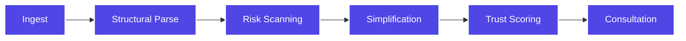

<div align="center">
  

  <br>
  🌐 DEPLOYED LINKS (LIVE)
  Frontend Dashboard: https://legaleaseaiagent.vercel.app/
  Backend API: https://legalease-ai-agent.onrender.com
  API Documentation: https://legalease-ai-agent.onrender.com/docs

  <br>
  <h1>⚖️ LegalEase AI</h1>
  <h3>Next-Gen Legal Intelligence for Everyone</h3>

  [](https://opensource.org/licenses/MIT)
  [](https://codequest.ai)
  [](https://supervity.ai)

  **Legal document clarity in < 10 seconds. Powered by Supervity AI Agents.**
</div>

---

## 🌟 The Vision

Legal documents are intentionally complex, often hiding risks in dense legalese. **LegalEase AI** is a production-grade intelligence platform that empowers everyday people to audit contracts, job offers, and rental agreements before signing them.

> [!IMPORTANT]
> This isn't just a chatbot—it's a multi-staged **AI Agentic Workflow** that dissects legal text with structural precision, identifying liability traps before they become problems.

---

## 🧠 The Agentic Workflow

Our AI Agent follows a structured multi-node execution path to ensure 99% extraction accuracy and deep reasoning:

<div align="center">



</div>

| Stage | Description | Key Agent Capability |
| :--- | :--- | :--- |
| **1. Ingest** | Securely parses uploaded PDFs into an isolated cloud vault. | OCR & Pre-processing |
| **2. Structural Parse** | Detects hierarchy: clauses, headers, parties, and dates. | Entity Recognition |
| **3. Risk Scanning** | Identifies 50+ common legal red flags and unfair conditions. | Anomaly Detection |
| **4. Simplification** | Translates legalese into plain human language. | NLU & Paraphrasing |
| **5. Trust Scoring** | Calculates a safety metric (0-100) based on risk density. | Quantitative Audit |
| **6. Consultation** | Active follow-up via an integrated AI chat for deep clarity. | Contextual Reasoning |

---

## 🎨 Premium Features

- **🔥 Risk Heatmap**: Instantly see which clauses are 🔴 Risky, 🟡 Caution, or 🟢 Safe.
- **🌐 Multilingual**: Native support for **English**, **Hindi**, and **Telugu**.
- **🎤 Voice Summary**: Listen to the legal summary using integrated text-to-speech.
- **📱 One-Tap Share**: Export insights directly to WhatsApp or Email.
- **💬 Interactive Auditor**: A chat panel that knows every detail of your contract.

---

## 🖥️ Tech Stack

<div align="center">

| | Technology | Purpose |
| :--- | :--- | :--- |
| **Frontend** | **React 18 + Vite** | High-performance SPA with instant HMR. |
| **Logic** | **Framer Motion** | High-fidelity UI interactions and fluid transitions. |
| **Styling** | **Tailwind CSS** | Custom glassmorphism design system & responsive layout. |
| **Backend** | **FastAPI** | Async Python framework for rapid API serving. |
| **Agentic AI** | **Supervity AI** | Multi-node Agentic execution for complex reasoning. |

</div>

---

## 📁 Project Structure

```bash
legal-ease/
├── backend/            # FastAPI Server
│   ├── routes/        # Modular API Endpoints
│   ├── main.py        # API Core & Agent Logic
│   └── .env           # Environment Configuration
└── frontend/           # React Application
    ├── src/
    │   ├── components/ # Modular UI Components
    │   ├── pages/      # View Layouts (Landing, Dashboard)
    │   └── App.jsx     # Main Entry
```

---

## ⚙️ Quick Start

### 1. Setup Backend
```powershell
cd backend
python -m venv venv
./venv/Scripts/activate
pip install -r requirements.txt
# Update .env with your credentials
uvicorn main:app --reload
```

### 2. Startup Frontend
```powershell
cd frontend
npm install
npm run dev
```

---

## 🏆 Hackathon Context
**Project:** LegalEase AI (#08)  
**Track:** AI Tools for Common People  
**Event:** CodeQuest AI Final Round  

<div align="center">
  <p>Created with passion for legal accessibility.</p>
  <strong>⭐ Give us a star if this helps you sign better contracts! ⭐</strong>
  
  <br>
  
  [Website](https://legalease-ai.com) • [Documentation](https://docs.legalease-ai.com) • [Support](mailto:hello@legalease-ai.com)
</div>
